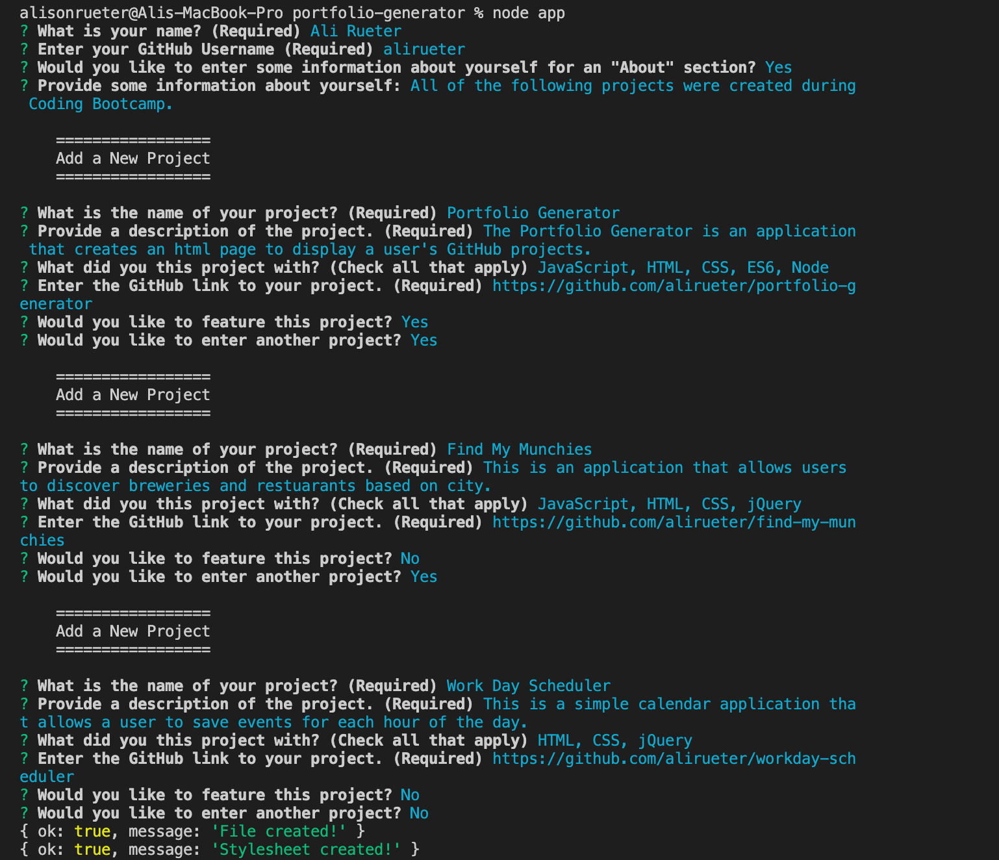
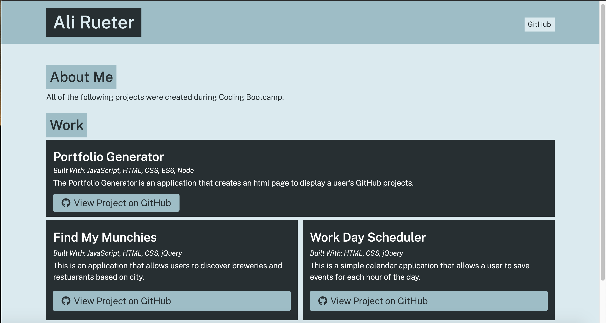

# Portfolio Generator
The Portfolio Generator is an application that creates an html page to display a user's GitHub projects. 

### Instructions
To use the application, you must clone the repo to your local machine and run it from there. Once you have the repo on your local machine, you can invoke the application by using the following command in your terminal: `node app.js`. Make sure that you are in the root directory of the repository in your terminal before invoking the application.

Once you invoke the application, a series of prompts will appear in your terminal. Answer the prompts accordingly. You can feature projects to be displayed at the top of the generated html. Once you are done entering your projects, the generated html and stylesheet will be in the `dist` directory. Open the `index.html` file in the browser to see your new portfolio page. 

### Application

